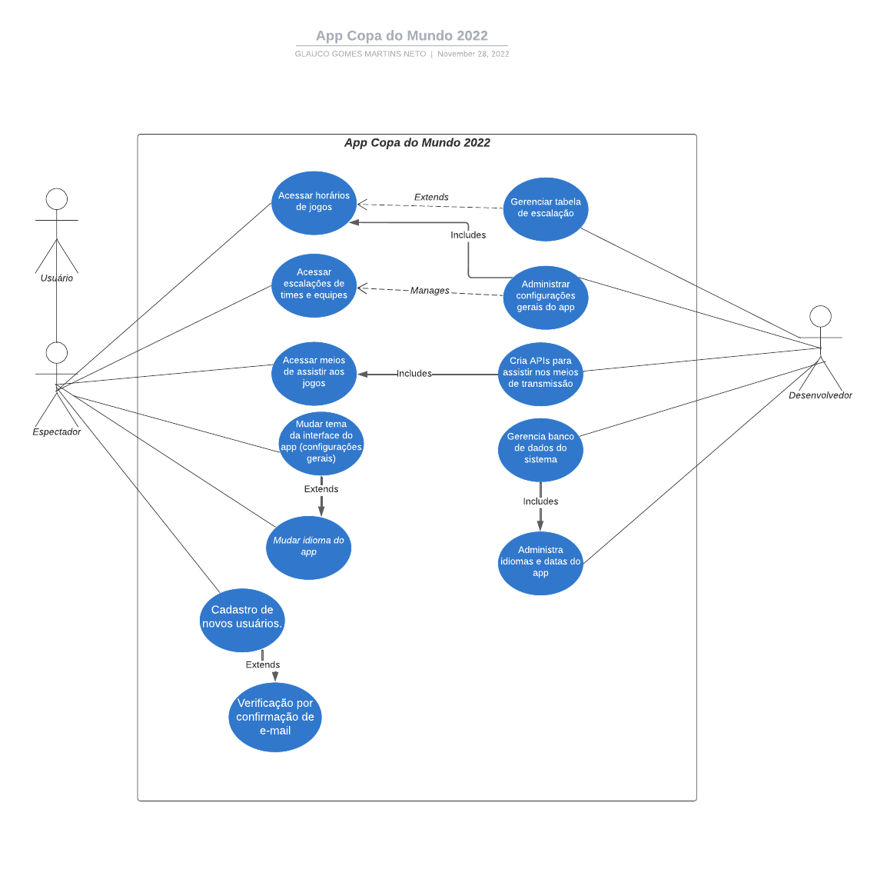

# AppCopa2022

## Sobre o projeto
Desenvolvimento de uma aplicação mobile por meio de processos de desenvolvimento gerenciados pela engenharia de software. O app tem como tema a Copa do Mundo da Fifa de 2022. Assim, por meio deste projeto, foi possível colocar em prática diversas habilidades abordadas em aula.

Projeto feito por alunos do segundo semestre do curso de Tecnologia em Análise e Desenvolvimento de Sistemas da Faculdade de Tecnologia de Campinas.

Integrantes:
- Cássia Xavier
- Franciele Procopio
- Glauco Neto

---
## Componentes

Até o momento, foi desenvolvido quase completamente o diagrama de caso de uso (acesse [aqui](./AppCopa2022.png)). Fazendo parte do processo de desenvolvimento e organização do app, também foi desenvolvido telas de protótipo, para que se possa ter uma ideia de como foi pensado as funcionalidades do aplicativo, além de escolhas de cores e estilos diversos. Para a organização dos processos de desenvolvimento por meio de etapas, foi feito um SCRUM para o projeto. Para realizar testes na aplicação, foram realizados por meio de uma planilha.

Requisitos. Para os requisitos, foram pensados os requisitos funcionais e não funcionais. São eles:

Funcionais

- Acessar horários de jogos
- Visualizar escalações de times
- Ver opções dos meios de assistir aos jogos
- Poder mudar tema do app
- Conseguir alterar o idioma do app
- Cadastro e login de usuários

Não funcionais

- Aplicativo mobile
- Funcionamento no Sistema Android (última atualização)
- A aplicação funciona online
- O sistema deve respeitar o tempo máximo de 140 segundos durante o processamento.

### Diagrama de Caso de uso

Para o diagrama de caso de uso, foi realizado pensando em ações gerais e específicas, como o usuário e espectador realizar o acesso a horários dos jogos, escalações de times e equipes, poder mudar tema do app. Além de ações gerais, foi realizado especificações de ações que extendem de outras ou inclue outras. Além do ator de espectador e usuário, foi criado também ações para o ator de desenvolvedor, onde é pensado ações administrativas gerais do aplicativo.

### SCRUM

Para a organização de todas os passos do projeto, foi feito um SCRUM para a simulação da organização do projeto, colocando em evidência conjunto de atividades (chamadas sprint backlog) para o andamento do projeto.

Essa é a organização geral do SCRUM do projeto:

Acesse o SCRUM completo [aqui](https://trello.com/invite/b/hxyVg54X/ATTI003d8adddee4dc5d50a08329c941d81720A53F0D/app-copa-do-mundo-scrum)

### Protótipo

Para termos uma noção de como ficaria o app de acordo com a nossa percepção, montamos telas de protótipos. Dessa maneira, foi concebido com escolhas de estilos, de escolhas de ícones e escolha de imagens para o app. A concepção geral ficou assim:

Tela inicial e de resultados

Tela de cronograma e classificação

### Teste
Para os testes do nosso app, foi utilizado uma planilha de testes utilizando parâmetros (dados de entrada), os procedimentos (o que seria feito a partir dos parâmetros), o resultado esperado de cada teste e o resultado obtido. Os testes realizados foram: teste de conectividade (com wi-fi ou dados móveis), teste de cadastro, teste de login e teste de streaming. Na imagem a seguir é possível ver com mais detalhes cada teste.

Para acessar o arquivo da planilha, clique [aqui](./Plano%20de%20Teste.xlsx)